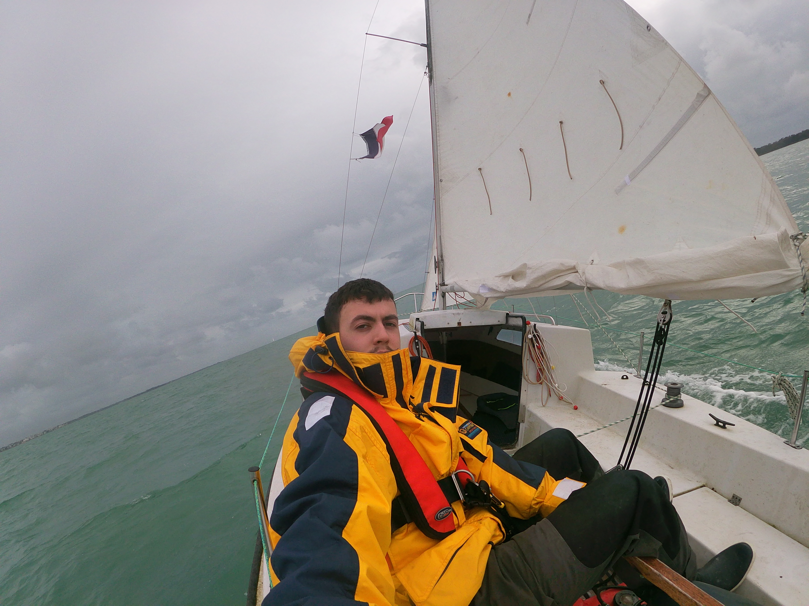

# Objectif Grand Large

## Description

"Objectif Grand Large" is a project aimed at supporting my brother-in-law, [Louis Claudepierre](https://www.instagram.com/louis_cpe?igsh=MTFqY2Q5MDk5ejFm), in his ambitious endeavor of crossing the Atlantic Ocean. This project involves creating a website to document his journey, showcase his preparations, and attract potential sponsors to support this challenging adventure.

## Project Goals

The main objectives of "Objectif Grand Large" are:

1. **Supporting the Journey**: Providing a platform to share updates, stories, and progress throughout the preparation and execution of the Trans-Atlantic voyage.
2. **Building Awareness**: Raising awareness about the journey, its challenges, and the determination required to undertake such a feat.
3. **Finding Sponsors**: Attracting sponsors and partners who are willing to support financially or through provision of equipment and resources.
4. **Inspiring Others**: Inspiring others to pursue their dreams and embark on their own adventures, no matter how daunting they may seem.

## How You Can Help

There are several ways you can contribute to the success of "Objectif Grand Large":

1. **Spread the Word**: Share the project with your friends, family, and network to increase visibility and support.
2. **Sponsorship Opportunities**: If you or your company are interested in sponsoring the journey, please reach out to us through the contact information provided below.
3. **Technical Support**: If you have expertise in web development, design, or any related field, your assistance in building and maintaining the [website](https://www.louis-claudepierre.fr/) would be greatly appreciated.
4. **Encouragement**: Offer words of encouragement and moral support to Louis as he prepares for this incredible adventure.

## Contact Information

For inquiries, sponsorship opportunities, or to offer support, please contact:

[Louis Claudepierre](mailto:objectif.grand.large@gmail.com)

## License

This project is licensed under the [MIT License]().
